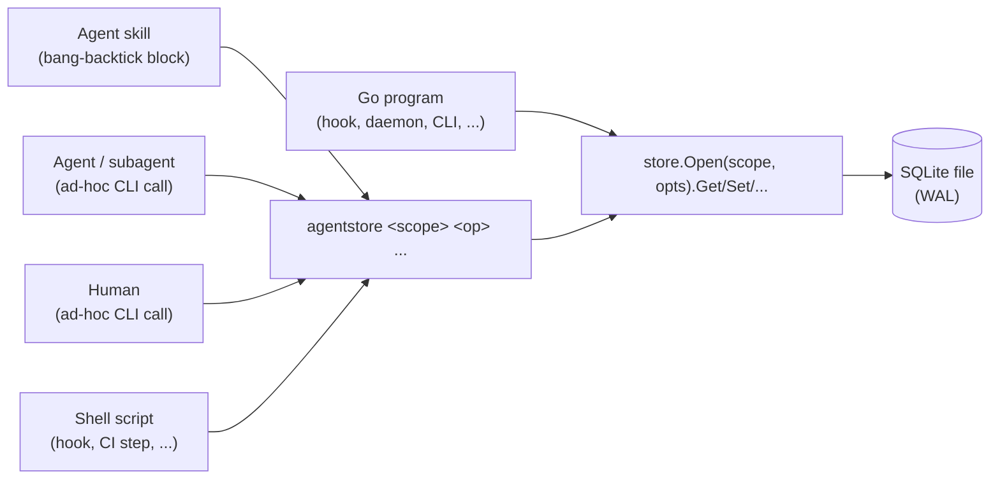
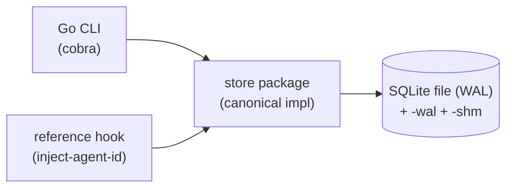

# agentstore

A small Go key-value store on top of SQLite. Claude Code agents reach for it as a scratchpad with three possible lifetimes: per project, per session, or per subagent. Any client that finds the right file and follows the schema can read and write. Skill bang-backtick blocks invoke it. Shell hooks invoke it. Ad-hoc terminal calls invoke it. Long-running Go processes import the package directly. Environment variables that Claude Code populates pin the store's location on disk, so a hook, a subagent, and the main agent share state without passing handles around.

## Motivation

Agents and the tools they invoke need somewhere to leave notes for each other within a run. A `PreToolUse` hook wants to count failed commands so a later hook can warn after ten. A subagent wants to record a result for the orchestrator to read back. A skill wants to stash a computed value so a later step in the same session can skip recomputing it. None of that belongs in the transcript, and none of it should leak into the next session unless that leak gets explicitly chosen.

The access pattern stays deliberately dumb. Every client opens the file just long enough to run its operation, then closes the handle. No daemon or long-lived process owns the database. SQLite's Write-Ahead Logging (WAL) mode keeps this safe across many short-lived processes, where concurrent readers never block each other and a single writer never blocks those readers. `busy_timeout` covers lock contention so callers skip writing retry loops themselves. That property explains why this store lives on SQLite rather than an embedded engine like bbolt, whose exclusive file lock makes open-close-per-operation from many processes a poor fit.

## Scopes

Callers pick one of three scopes per operation, or pin a default in client config. Each resolves to a database file and a namespace within it.

| Scope | Database file | Namespace | Lifetime | Located via |
| --- | --- | --- | --- | --- |
| `project` | `$XDG_DATA_HOME/agentstore/project/<project-id>.db` | `_root` | Persists across sessions | `$CLAUDE_PROJECT_DIR` (hashed), then `git rev-parse --show-toplevel` |
| `session` | `$XDG_DATA_HOME/agentstore/session/<session-id>.db` | `_root` | Lives for one session | `$CLAUDE_CODE_SESSION_ID` |
| `subagent` | `$XDG_DATA_HOME/agentstore/session/<session-id>.db` | `<agent-id>` | Lives with the session | `$CLAUDE_CODE_SESSION_ID` + `$CLAUDE_CODE_AGENT_ID` |

When `$XDG_DATA_HOME` doesn't resolve, the store falls back to `$HOME/.local/share` per the XDG Base Directory Specification.

The `session` and `subagent` scopes share one physical file because a subagent has no lifetime beyond the session that spawned it. The namespace column separates them. A `session` write lands in the reserved `_root` namespace that every agent in the session can read and write. A `subagent` write lands in a namespace keyed by the agent's ID, walled off from peers. Every subagent picks its scope on each operation: write to `session` scope to coordinate with the orchestrator and siblings, or write to `subagent` scope for private working state nobody else touches.

Agent teams reuse the same model. Claude Code teammates share one `session_id` with the lead, so `session` scope doubles as the team-coordination scope. Each teammate's distinct `agent_id` keys its own `subagent` namespace. No separate team scope exists in the core schema. Team-aware patterns live on top, in user-supplied hooks (see Patterns built on top).

Namespaces give logical isolation rather than physical, so a buggy client could read another namespace if it tried. Physical isolation (one file per subagent) might come later. See Open questions.

The `project` scope lives in a separate file because its lifecycle stays independent. It outlives session ends and accumulates state across many runs against the same repository.

## Claude Code integration

The store relies on identity that Claude Code already mints. The job of any integration code, including the reference hook below, comes down to surfacing that identity to the bash environment where the CLI runs.

### Native environment

Every Bash tool call inherits these variables from Claude Code without any user hook:

| Variable | Source | Purpose |
| --- | --- | --- |
| `CLAUDE_CODE_SESSION_ID` | Native | Session identity. Same value across the main agent and every subagent and teammate in the session. |
| `CLAUDE_CODE_ENTRYPOINT` | Native | How Claude got invoked (`sdk-cli`, etc.). Useful provenance. |
| `CLAUDECODE` | Native | Marker for "running inside Claude Code." |
| `CLAUDE_EFFORT` | Native | Effort level (`xhigh`, etc.). |
| `CLAUDE_PROJECT_DIR` | Hook-process env only | Available to hooks but not to bash tool calls by default. |

Session ID arrives at every bash call without any hook. The project directory, the agent ID, and the agent type all need a hook to land in the bash env.

### Hook events

| Event | Fires on | Useful payload fields |
| --- | --- | --- |
| `SessionStart` | Main agent | `session_id`, `transcript_path`, `cwd`, `source`, `model` |
| `PreToolUse` | Main agent OR subagent/teammate | `session_id`, `tool_name`, `tool_input`, `tool_use_id`, plus `agent_id` and `agent_type` when fired inside a subagent |
| `SubagentStart` | Each subagent / teammate | `session_id`, `agent_id`, `agent_type`, `cwd` |
| `SubagentStop` | Each subagent / teammate | `session_id`, `agent_id`, `agent_type`, `agent_transcript_path`, `last_assistant_message`, `background_tasks` (team members listed when applicable) |
| `TeammateIdle` | Lead, after each teammate stop | `team_name`, `teammate_name` (no `agent_id`) |
| `TaskCreated` | Main agent / lead, on `TaskCreate` tool invocation | `task_id`, `task_subject`, `task_description` (no `agent_id`) |
| `TaskCompleted` | Main agent / lead, on `TaskUpdate` marking a task complete | `task_id`, `task_subject`, `task_description` (no `agent_id`) |

A teammate's `agent_type` equals the teammate's name (`"Alpha"`, `"Bravo"`). Task subagents spawned with an explicit `subagent_type` carry that value (`"Explore"`, `"Plan"`, etc.). The default carries `"general-purpose"`. The `agent_type` field in `SubagentStart` matches the `teammate_name` field in `TeammateIdle`, which lets a hook join the two without storing extra mapping state beyond the agent ID.

### Bash command injection

Every Bash tool call triggers a `PreToolUse` hook registered with no matcher (or `matcher: "Bash"`). That hook reads the JSON payload from stdin and can rewrite the tool input by emitting JSON of this shape on stdout:

```json
{
  "hookSpecificOutput": {
    "hookEventName": "PreToolUse",
    "permissionDecision": "allow",
    "updatedInput": {
      "command": "export CLAUDE_CODE_AGENT_ID='...' CLAUDE_CODE_AGENT_TYPE='...'; <original>"
    }
  }
}
```

A reference hook (described in the next section) prepends `export CLAUDE_CODE_AGENT_ID='<agent_id>' CLAUDE_CODE_AGENT_TYPE='<agent_type>';` (with a trailing space) whenever the payload includes `agent_id`. Main-agent calls have no `agent_id`, so no rewrite happens, and the store CLI falls back to session scope with `written_by = "main"`.

Prepending in this form survives every natural shell construct: `&&`, `||`, `;`, pipes, subshells, `bash -c` / `sh -c`, command substitution, heredocs, and `set -u`. Single-quoted literals don't expand the variables (correct shell semantics). Callers can defeat the injection deliberately with `env -i` or explicit local assignment (`CLAUDE_CODE_AGENT_ID=other cmd`), which matches user intent in those cases.

### MCP tool injection (future agentstore MCP server)

PreToolUse fires identically for MCP tool calls and built-in tool calls. Only the `tool_name` field differs. MCP tools follow the pattern `mcp__<server>__<tool>` (double underscore separators), such as `mcp__agentstore__set`. Matchers for MCP tools need a regular-expression wildcard, since `mcp__agentstore` matches nothing on its own (compared as a literal string). Use `mcp__agentstore__.*` to match all tools under one server.

A v2 agentstore MCP server would let non-Bash callers reach the store. Bash export tricks don't apply to MCP, but the same PreToolUse rewrite mechanism still works. Instead of editing `tool_input.command`, the hook edits the MCP tool's structured input to embed `agent_id` and `agent_type` in fields the server reads at handler time. Exact shape depends on the agentstore MCP tool schema, designed alongside the server itself (out of scope for v1).

### Hook failure modes

A PreToolUse hook produces one of these outcomes through its stdout and exit code:

| Exit code | stdout | Outcome | stderr surfaced to assistant |
| --- | --- | --- | --- |
| 0 | Valid `{"hookSpecificOutput": ...}` | Tool runs with rewritten input | No |
| 0 | Empty | Tool runs with original input | No |
| 0 | Malformed JSON or wrong shape | Tool runs with original input (silent skip) | No |
| 1 (any non-zero except 2) | Anything | Tool runs with original input (silent skip) | No |
| 2 | Anything | Tool **blocked**, stderr message reaches the assistant | Yes |

Silent-skip on non-zero exit and malformed JSON makes a buggy hook degrade gracefully rather than break the agent. Less helpfully, a hook with broken output goes unnoticed unless it logs separately. Reference-quality hooks should log their own errors to a sidecar file.

Exit code 2 acts as the documented blocking mechanism. The stderr message becomes part of the assistant's context, so it doubles as a feedback channel (a rate-limit gate could surface "exceeded ten failed commands, slow down").

### Reference hook

`tools/agent/store/hooks/inject-agent-id` (Go binary) ships the rewrite. Registration in `.claude/settings.json`:

```json
{
  "hooks": {
    "PreToolUse": [
      {
        "matcher": "Bash",
        "hooks": [
          {"type": "command", "command": "${CLAUDE_PROJECT_DIR}/.claude/hooks/inject-agent-id"}
        ]
      }
    ]
  }
}
```

The hook stays optional. Session scope and project scope work without it. Subagent scope needs it.

## Callers



- **Agent skills** open with a bang-backtick block that runs the CLI and embeds stdout. A skill that wants a value from session state calls `just agents store session get <key>`.
- **Agents and subagents** run the CLI directly during a session. A subagent records a result with `agentstore subagent set result ...`. The orchestrator reads it back from `session` or `subagent` scope.
- **Humans** run the CLI from a terminal to inspect or seed state while debugging a workflow.
- **Shell scripts** invoke the CLI directly or through `just agents store`. The category covers Claude Code hooks under `.claude/hooks/`, one-off scripts, and CI steps.
- **Go programs** import the package and call the Go API. Go-based hooks skip process startup on every call, which matters for a `PreToolUse` hook that fires on every tool use. A Go hook also reads `agent_id` directly from the hook payload, skipping the env-var dance entirely.

The Go CLI and Go API share one code path. Non-Go clients defer to v2 (see Out of scope for v1).

## CLI

```text
agentstore <scope> <op> [flags] [args]

Scopes:
  project     Per-project store, persists across sessions
  session     Per-session store, shared _root namespace
  subagent    Per-session store, namespace keyed by agent id

Operations:
  get <key>                 Print the value for key (exit 1 if absent unless --default)
  set <key> <value>         Set key to value (use --if-equal for value-based CAS)
  setnx <key> <value>       Set only if key absent; exit 1 if key already exists
  del <key|--prefix <p>>    Delete key, or every key matching the prefix
  has <key>                 Exit 0 if key exists, 1 otherwise
  keys [--prefix <p>]       List keys, optionally filtered by prefix
  incr <key> [--by <n>]     Atomically add n (default 1), print the new value
  decr <key> [--by <n>]     Atomically subtract n, print the new value
  append <key> <value>      Atomically append value to the JSON array at key
  sadd <key> <member>       Idempotently add member to the JSON set at key
  srem <key> <member>       Remove member from the JSON set at key
  sismember <key> <member>  Exit 0 if member is in the set, 1 otherwise
  smembers <key>            List members of the JSON set at key
  dump                      Print the whole namespace as JSON (debugging)
  init                      Create the database and apply schema + pragmas
  destroy                   Remove the database file(s) for this scope

Common flags:
  --json                    Treat set/append/sadd values as JSON, not strings
  --default <v>             Value to print when get misses, suppresses exit 1
  --if-equal <v>            For set: write only if current value equals v (value-based CAS)
  --ttl <duration>          Expiry for set (e.g. 30m, 2h); lazily reaped on read
  --by <id>                 Override the written_by provenance value
  --timeout <duration>      SQLite busy_timeout override (default 5s)

Scope-resolution overrides (normally taken from the environment):
  --project-dir <path>      Override $CLAUDE_PROJECT_DIR
  --session-id <id>         Override $CLAUDE_CODE_SESSION_ID
  --agent-id <id>           Override $CLAUDE_CODE_AGENT_ID
```

Values default to strings, switching to JSON when `--json` arrives on the command line. Keys follow a `.`-separated path convention (`counters.tool_calls`), with `\.` for a literal dot. Path-targeted operations like `incr` and `append` reach into nested JSON via SQLite's JSON1 functions so the read-compute-write happens atomically inside one statement instead of as a client-side loop. A non-zero exit accompanies any hard error (scope unresolvable, database missing when required, write failure). `get` on a missing key exits 1 unless `--default` arrives too.

The bare convenience recipe `just agents store <scope> <op> ...` wraps `go run ./tools/agent/store` so skill blocks and hooks stay terse.

## Go entrypoint

```go
// Open resolves the scope to a database file and namespace, opens it with the
// shared pragmas, then returns a handle. The handle holds one *sql.DB; callers
// that do many operations reuse it, short-lived callers Close when done.
func Open(scope Scope, opts ...Option) (*Store, error)

type Scope string

const (
    Project  Scope = "project"
    Session  Scope = "session"
    Subagent Scope = "subagent"
)

func (s *Store) Get(key string) (Value, error)
func (s *Store) Set(key string, v Value, opts ...WriteOption) error
func (s *Store) Delete(key string) error
func (s *Store) DeletePrefix(prefix string) (int, error)
func (s *Store) Has(key string) (bool, error)
func (s *Store) Keys(prefix string) ([]string, error)
func (s *Store) Incr(key string, by int64) (int64, error)
func (s *Store) Append(key string, v Value) error
func (s *Store) Close() error

// SetNX writes only if the key is absent. Returns true on success, false if
// the key already exists. Foundational for claim semantics (locks, phase
// ownership) without the read-CAS dance.
func (s *Store) SetNX(key string, v Value, opts ...WriteOption) (bool, error)

// SetIfEqual writes v only if the current value matches expected. Returns
// ErrValueConflict on mismatch. Value-based CAS, distinct from the
// version-based CompareAndSwap below.
func (s *Store) SetIfEqual(key string, expected, v Value, opts ...WriteOption) error

// CompareAndSwap writes v only if the current version matches. A miss returns
// ErrVersionConflict so the caller can re-read and retry. The version comes
// back from Get via Value.Version.
func (s *Store) CompareAndSwap(key string, expected uint64, v Value) error

// Set operations: members are stored as a JSON array; SAdd / SRem maintain
// uniqueness atomically via JSON1.
func (s *Store) SAdd(key string, member Value) error
func (s *Store) SRem(key string, member Value) error
func (s *Store) SIsMember(key string, member Value) (bool, error)
func (s *Store) SMembers(key string) ([]Value, error)

// Scope-resolution and behavior options.
func WithProjectDir(path string) Option       // override $CLAUDE_PROJECT_DIR
func WithSessionID(id string) Option           // override $CLAUDE_CODE_SESSION_ID
func WithAgentID(id string) Option             // override $CLAUDE_CODE_AGENT_ID
func WithTimeout(d time.Duration) Option       // busy_timeout, default 5s
func WithTTL(d time.Duration) WriteOption      // expiry on a single write
func WithProvenance(by string) WriteOption     // override written_by
```

The Go API lives next to the CLI's `main.go`. Both call the same internal store. The CLI works as a thin cobra layer that maps subcommands and flags onto these methods. Long-running Go consumers (such as a `PreToolUse` hook) call `Open` once and reuse the handle.

## Architecture



Go owns one canonical code path: the schema, the embedded migration runner, the CLI, the reference hook binary, and the Go package every consumer imports. The schema lives in `schema.sql`, embedded into the binary via `embed.FS`. The migration runner applies it on `init` and idempotently on open.

## Schema

```sql
CREATE TABLE entries (
    namespace   TEXT NOT NULL,   -- '_root' for project/session, agent id for subagent
    key         TEXT NOT NULL,   -- dot-path convention, '\.' escapes a literal dot
    value       TEXT NOT NULL,   -- JSON-encoded (a bare string becomes a JSON string)
    version     INTEGER NOT NULL DEFAULT 1,  -- bumped on every write, for CAS
    written_by  TEXT,            -- agent id or 'main' or caller-supplied provenance
    written_at  TEXT NOT NULL DEFAULT (strftime('%Y-%m-%dT%H:%M:%fZ', 'now')),
    expires_at  TEXT,            -- nullable; lazily reaped on read, eagerly on `init`
    PRIMARY KEY (namespace, key)
) STRICT;

CREATE INDEX idx_entries_namespace ON entries(namespace);
CREATE INDEX idx_entries_expires ON entries(expires_at) WHERE expires_at IS NOT NULL;

PRAGMA user_version = 1;
```

`STRICT` enforces column types so a wrong-typed write fails loudly rather than silently coercing. Values always store as JSON. `set foo bar` stores the JSON string `"bar"`. `set --json foo '{"a":1}'` stores the object. That uniformity lets the JSON1 path operations work the same way on every key.

## Scope resolution

Resolution runs in a fixed order per scope. The CLI refuses to guess when it can't resolve cleanly.

**Project.** Explicit `--project-dir` / `WithProjectDir`, then `$CLAUDE_PROJECT_DIR`, then `git rev-parse --show-toplevel` from the working directory. The resolved path gets hashed to form the filename. When none resolve, the operation errors. Claude Code sets `CLAUDE_PROJECT_DIR` for hook-process env but not for bash tool env, so the CLI typically falls back to the git toplevel unless a SessionStart hook exports the value.

**Session.** Explicit `--session-id` / `WithSessionID`, then `$CLAUDE_CODE_SESSION_ID`. Claude Code sets `CLAUDE_CODE_SESSION_ID` natively in every bash tool call, so this resolves cleanly without any hook.

**Subagent.** Resolves a session ID as in the preceding bullet, then an agent ID: explicit `--agent-id` / `WithAgentID`, then `$CLAUDE_CODE_AGENT_ID`. When the session resolves but the agent ID doesn't, the operation errors rather than silently falling back to `session` scope, because a silent fallback would write isolated state into the shared namespace and defeat the point of the scope. A caller that wants "subagent if available, else session" asks for that explicitly by catching the error and reopening at `session` scope.

Unset versus set-but-wrong values get different treatment. Error messages name which variable failed to resolve, so a misconfigured hook stays easy to trace.

## Concurrency and atomicity

Parallel subagents and team members can write concurrently, so the store leans on two mechanisms:

- **SQLite WAL plus `busy_timeout`** covers process-level contention. Readers never block. A writer waits up to the timeout for the write lock and surfaces `SQLITE_BUSY` if it can't get it. No client writes a retry loop for lock contention.
- **Optimistic concurrency via `version`** handles logical conflicts on full-value replacement. `Get` returns the current version. `CompareAndSwap` writes only if it still matches, returning `ErrVersionConflict` on a miss so the caller rereads and retries. This covers the path for read-then-rewrite of a whole value.

Targeted mutations skip the Compare-And-Swap (CAS) dance entirely. `Incr`, `Decr`, and `Append` compile to a single `UPDATE` that reads, computes, then writes inside SQLite's write transaction using JSON1 functions (`json_set`, `json_extract`, `json_insert`). Two agents incrementing the same counter serialize inside the engine with no lost updates and no client-side retry. The `version` column still covers whole-value replacement, while JSON1 handles the surgical edits.

Real concurrency observed in testing: a team of three members had its SubagentStart events arrive roughly one second apart, and the resulting tool-call events overlapped across the window. SQLite's WAL handles millisecond-scale contention trivially. In practice the natural Claude Code spin-up pacing already prevents most contention from arising at all.

## Pragmas

Every client applies the same set on every open:

```sql
PRAGMA journal_mode = WAL;
PRAGMA synchronous = NORMAL;
PRAGMA busy_timeout = 5000;
PRAGMA foreign_keys = ON;
PRAGMA temp_store = MEMORY;
```

WAL mode persists in the file metadata, so reasserting it on every open stays redundant but cheap and defends against a client that opened without it. The `synchronous = NORMAL` setting pairs naturally with WAL and keeps writes durable enough for coordination state without the full-sync cost on every commit.

## Lifecycle

- **`SessionStart` hook** (optional) runs `agentstore session init` to create the session database and apply the schema and pragmas before anything reads it. Lazy creation on first write covers the fallback when the hook doesn't fire, so a race against `SessionStart` can't lose data. `init` provides the eager, explicit path.
- **`PreToolUse` hook** (required for subagent scope) runs the agent-ID injection so the bash-invoked CLI sees `CLAUDE_CODE_AGENT_ID`.
- **`SubagentStop` hook** (optional) snapshots subagent-scope state into project-scope archives, or runs custom team-tracking logic.
- **`SessionStop` hook** (optional) archives rather than deletes by default. The session file moves to `$XDG_DATA_HOME/agentstore/archive/<YYYY-MM>/<session-id>.db`, with month directories created on the fly so the archive doesn't become one enormous folder. A `--delete-on-stop` flag opts into destructive cleanup. Archiving keeps post-hoc "what did this session do" analysis cheap, on the reasoning that disk space costs less than the context a delete would throw away.
- **Project databases** never get reaped automatically. They persist by design. A separate `agentstore project destroy` or an external cron handles cleanup if anyone wants it.

## Patterns built on top

The store provides primitives. Higher-level semantics live in user-supplied hooks that compose those primitives. A few patterns that the verified hook events make natural:

### Team membership tracking

A teammate's `agent_type` field equals the `teammate_name` field on the lead's matching `TeammateIdle`. A two-hook pair captures the team roster in session scope:

```text
On SubagentStart:
  agentstore session set "subagents.<agent_id>" '{"agent_type": "<agent_type>", "started_at": "<ts>"}' --json

On TeammateIdle (lead-side):
  agentstore session set "teams.<team_name>.members.<teammate_name>" '{"agent_id": "<lookup>", "idle_at": "<ts>"}' --json
```

A reader joins the two on `agent_type == teammate_name` to recover the full team map. No "team scope" primitive needed.

### Per-subagent tool-call counters

A `PreToolUse` hook running for every tool call increments a counter, then lets a later hook gate behavior:

```text
On PreToolUse with agent_id present:
  agentstore subagent incr "tool_calls.<tool_name>"
  count=$(agentstore subagent get "tool_calls.Bash" --default 0)
  if [[ $count -gt 10 ]]; then warn or block; fi
```

### Subagent state archival on stop

`SubagentStop` carries the agent's transcript path and last assistant message. A hook can snapshot the subagent's namespace into project scope before it disappears:

```text
On SubagentStop:
  dump=$(agentstore subagent dump)
  agentstore project set "archive.subagents.<agent_id>" "$dump" --json
```

### Cross-teammate coordination

Teammates share a `session_id`, so any teammate can leave a coordination flag in session scope that siblings pick up. For race-to-claim semantics, `setnx` writes only if the key doesn't exist yet, returning success to the winner and already-exists to the loser. Richer update protocols use the `version` column plus `CompareAndSwap` for read-then-write conflicts.

### Inter-teammate message logging

Teammates use the `SendMessage` tool to message each other via the team inbox mechanism. PreToolUse fires for every SendMessage call with the sender's `agent_id` plus the recipient in `tool_input.to`. A hook can persist or transform the message before it lands in the inbox:

```text
On PreToolUse with tool_name == "SendMessage" and agent_id present:
  sender=<agent_id>; recipient=<tool_input.to>; content=<tool_input.message>
  agentstore session append "messages.<recipient>" '{"from": "<sender>", "content": "...", "ts": "..."}' --json
```

The same hook can rewrite `tool_input.message` via `updatedInput` before delivery. Examples: adding a sender prefix, redacting Personally Identifiable Information (PII) tokens, or translating shared vocabulary between team members.

### Lead-side todo archival

When the lead uses the `TaskCreate` tool to track work, `TaskCreated` fires with the new todo's metadata. `TaskCompleted` fires when `TaskUpdate` marks one complete. A hook captures both into project scope so the lead's intent and completion history survives across sessions:

```text
On TaskCreated:
  agentstore project append "todos.created" '{"id": "<task_id>", "subject": "<task_subject>", "ts": "..."}' --json

On TaskCompleted:
  agentstore project append "todos.completed" '{"id": "<task_id>", "ts": "..."}' --json
```

The result lives in the project's database and accumulates across runs against the same repository.

### Workflow phase gating

A multi-step workflow (`explore → plan → implement → review → ship`) lives in session scope, with the active phase as one key. Phases advance via value-based CAS so concurrent teammates can't both promote past a phase. Parallel work within a phase tracks completion via a set, and the lead reads that set to decide when to advance:

```bash
# Start a workflow
agentstore session set workflow.name "feature-dev"
agentstore session set workflow.phase "explore"

# Each parallel reviewer signals completion
agentstore session sadd "workflow.phases.review.completed_by" "$CLAUDE_CODE_AGENT_TYPE"

# The lead advances only when all reviewers reported done
done=$(agentstore session smembers "workflow.phases.review.completed_by" | jq length)
if [[ $done -eq 3 ]]; then
  agentstore session set workflow.phase "ship" --if-equal "review"
fi
```

Workflow templates live in project scope: `workflows.templates.<name>` describes the phase list and expected agent counts. Completed-workflow history accumulates in `workflows.history`.

### Tool-call gating by workflow phase

A `PreToolUse` hook reads the active phase from session scope and either allows the call (exit 0) or blocks it with feedback (exit 2 plus stderr message). This turns the workflow phase into a policy boundary:

```bash
phase=$(agentstore session get workflow.phase --default "")
case "$phase:$CLAUDE_TOOL_NAME" in
  explore:Edit|explore:Write)
    echo "phase=explore is read-only; no edits allowed" >&2
    exit 2
    ;;
  plan:Bash)
    case "$cmd" in
      git\ status*|git\ log*|git\ diff*|rg*) exit 0 ;;
      *) echo "phase=plan: only read-only bash allowed" >&2; exit 2 ;;
    esac
    ;;
esac
exit 0
```

The same pattern handles per-agent rate limits, post-failure cooldowns, approval gates, and budget enforcement. Each one reduces to "hook reads agentstore, decides exit code, optionally writes back." For non-trivial policy logic, writing the hook in Go and importing the agentstore package directly avoids per-call process startup.

### Template rendering with contexttemplate

The companion tool `contexttemplate` renders Go templates into Markdown chunks that inline into skill prompts and hook context. Its registry pattern exposes agentstore read operations as template funcs, so skills and hooks render with live KV state baked in:

```text
{{ with safeAgentstoreSession "workflow.phase" -}}
**Active phase**: {{ . }}
{{- end }}

{{ with safeAgentstoreSessionKeys "lock.files." -}}
**Files locked this session**:
{{ range . }}- {{ trimPrefix "lock.files." . }}
{{ end -}}
{{ end }}

{{ with safeAgentstoreProject "tool_calls.Bash.failed" -}}
History: {{ . }} bash failures across this repo's lifetime.
{{- end }}
```

The registry imports the agentstore Go package, opens one handle per scope per `Render` call, and exposes `agentstoreSession` / `agentstoreProject` / `agentstoreSubagent` template funcs (plus `*Has`, `*Keys`, `*Dump` variants). Reads only. Errors land in contexttemplate's per-render sink and templates fall back via `{{ with }}` on nil.

## Project layout

```text
tools/agent/store/
  main.go                  # cobra CLI dispatch (scope + op subcommands)
  store.go                 # Open(), the Store handle, Go API methods
  scope.go                 # scope resolution from env + overrides
  schema.sql               # canonical schema, embedded via embed FS
  migrate.go               # idempotent migration runner, user_version gate
  pragmas.go               # the shared pragma set
  json_ops.go              # incr/decr/append via JSON1
  options.go               # Option / WriteOption types
  errors.go                # ErrVersionConflict, ErrScopeUnresolved, ...
  store_test.go            # Go unit tests
  hooks/
    inject-agent-id/       # reference PreToolUse hook (main.go + main_test.go)
```

## Open questions

A short list of items that need confirming or deciding before v1 lands.

- **Pure-Go SQLite for the Go side.** The choice between `modernc.org/sqlite` (cgo-free, keeps the tool `go install`-able without a C toolchain) and `mattn/go-sqlite3` (cgo, upstream SQLite) stays open. The cgo-free option's WAL multi-process behavior wants a spot-check before committing.
- **Time-To-Live (TTL) semantics for project scope.** Lazy reap on read leaves unread keys around forever, which matters less for session scope (file gets archived anyway) but lets the project database grow unbounded over many runs. An optional `agentstore project vacuum` recipe, or eager reap on `init`, deserves a decision.
- **Reference hook packaging.** Whether to ship the agent-ID injection hook as a Go binary in the agentstore release, a shell script wrapper, or a `just` recipe that calls the Go CLI with a special flag, the three options all work. The choice comes down to install ergonomics for users who want subagent scope.

## Out of scope for v1

- **Python and TypeScript SDKs.** Non-Go callers can shell out to the CLI for v1. Direct-file SQLite bindings in other languages reopen the cross-language contract burden (shared schema, pragmas, operation semantics, fixture suite). The cost only pays off when a concrete consumer outside Go materializes.
- **MCP server.** Same reasoning. Defer until a use case that can't shell out shows up.
- **A daemon.** The open-close-per-operation model defines the v1 design. A per-session daemon owning the file (enabling pub/sub on key changes, Time-To-Live (TTL) with expiry callbacks, an in-memory hot path) might come later if passive-file features prove insufficient, but it stays out of v1.
- **Cross-session project coordination locking.** The project store stays single-writer-at-a-time like every scope. Distributed coordination across concurrent Claude Code sessions on the same project doesn't make the goal list.
- **Schema-defined value types.** Values stay opaque JSON that the store never inspects beyond confirming it parses. Callers own their own value contracts.
- **A query language.** Keys, prefixes, and JSON1 path operations cover the access surface. Callers can't pass arbitrary SQL through, and value contents don't get a secondary index.
- **A team scope primitive.** Team membership lives in session scope via user hooks (see Patterns built on top). Adding a fourth primitive scope for teams would duplicate session scope without adding capability.
- **Operations beyond the v1 surface.** The list below stays on the v2 roadmap because the v1 patterns in the preceding section don't need any of them yet:
  - **`mget` / `mset`.** Bulk multi-key reads and writes in one transaction. A latency optimization. Add when a hook's read pattern shows real per-call cost.
  - **`rename old new`.** Atomic key rename. Lets promotion patterns (subagent → session, session → project) skip the dump-set-delete dance.
  - **`getset`.** Atomic get-then-set returning the old value. Subsumed by `CompareAndSwap` plus a read for v1; promote to a primitive if call sites get awkward.
  - **`lpop` / `rpop` / `llen`.** Queue-style operations on the JSON-array convention. Inter-teammate message inboxes would consume these first.
  - **TTL management on existing keys.** `expire <key> <duration>`, `persist <key>`, and `ttl <key>` for adjusting expiry after the initial write. The v1 surface only sets TTL at write time.
  - **`history <key>`.** Audit-log-style read of past writes (who, when, what). Would need a separate audit table since the current schema overwrites in place.
