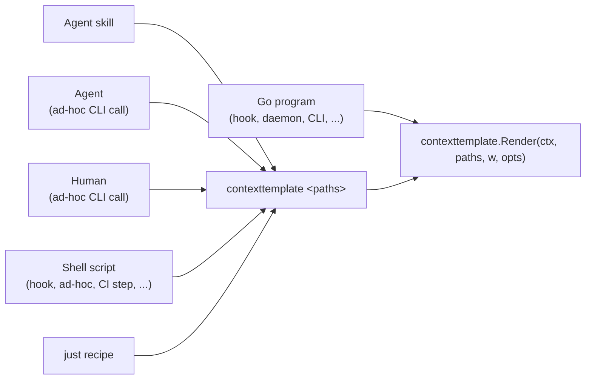
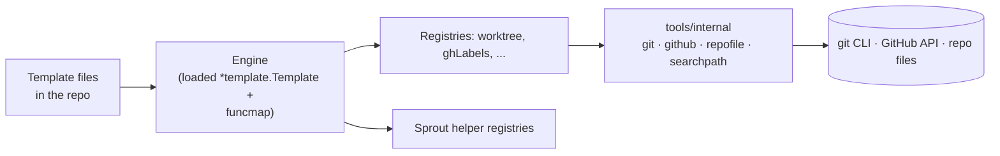
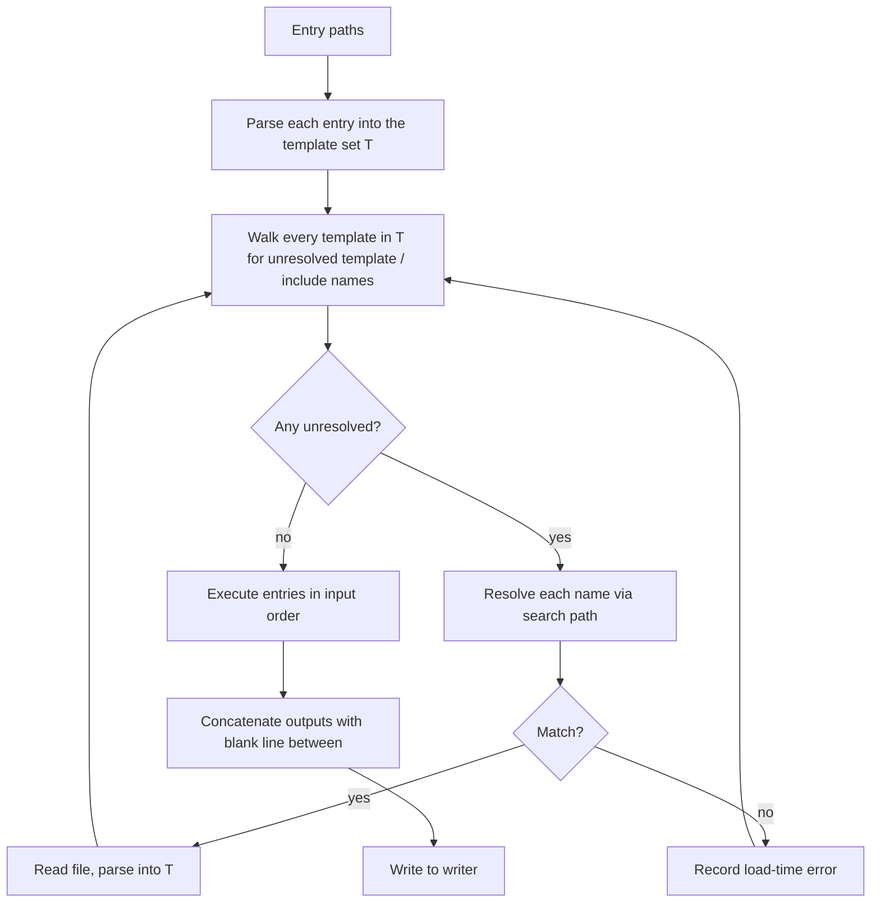

# Contexttemplate

A small Go renderer that turns one or more template files into a Markdown chunk fit for inlining into agent skills, hook prompts, or any other place that wants pre-computed repository context. Templates live next to their callers (agent skill directories, hook directories, anywhere in the repo). The renderer bundles a single loaded template (sprout helpers, project-local registries, project services) and a search path that resolves partial references the way Unix `$PATH` resolves binaries.

## Motivation

An agent skill often opens with a block of repository context: current worktree state, the project's Conventional Commits types and scopes, the GitHub labels and assignees available on the repo, and so on. The same context also feeds Claude Code hooks that augment tool calls or build prompts.

Hand-maintained context in the skill or hook file rots fast. A template renderer fixes that by sourcing each section from one canonical computation. Skills and hooks compose the sections they want from a shared catalog of helpers. Every caller reaches the same data through the same code path.

## Callers



Every caller path reaches the same `Render` function.

- **Agent skills** open with a block that runs the CLI and inlines its stdout into the skill prompt at load time. The rendered context goes into the prompt with no hand-maintained copy to drift.
- **Agents in an interactive session** run the CLI directly when they need to preview what a template renders. The pattern fits ad-hoc reasoning steps where the agent wants a snapshot of repository state without going through a skill.
- **Humans** run the CLI from a terminal to debug a template or inspect what a partial produces in isolation.
- **Shell scripts** invoke the CLI directly or through a just recipe. The category covers Claude Code hooks under `.claude/hooks/`, one-off scripts, and CI steps that need a snapshot of repository context.
- **just recipes** call the CLI like any other shell command. A recipe wraps the canonical invocation so the call site stays terse, and other recipes that want context chain off of it.
- **Go programs** import the package and call the Go entrypoint. The category covers Go-based Claude Code hooks and standalone Go CLIs that want rendered context as part of their own output. An in-process call skips the CLI round-trip and lets the caller pass options and inspect errors as Go values, which also makes the package straightforward to test.

## CLI

```text
contexttemplate <subcommand> [flags] <path> [path...]

Subcommands:
  render    Render templates and write output to stdout (default)
  lint      Lint templates without rendering, surfacing issues
  test      Run declarative template tests (v2, planned)

Flags shared by every subcommand:
  --search-path <dir>[:dir...]      Override the default search path
  --search-path-prepend <dir>       Prepend to the default search path
  --search-path-append <dir>        Append to the default search path

Lint-only flags:
  --format text|sarif|json          Output format (default: text)
  --strict                          Treat warnings as errors
  --rule <name>=on|off              Toggle a specific rule
```

The bare form `contexttemplate <path>` shortcuts to `render <path>` so skill blocks and recipe wrappers stay terse.

A render call may pass more than one path. Renders happen in input order and concatenate with a blank line between each output. The rendered Markdown writes to stdout. A non-zero exit code accompanies any hard error (file not found, parse failure, write failure). Runtime failures inside registries surface through sprout's safe-function wrapping and collect in the per-render error sink rather than aborting the render.

The environment variable `CONTEXTTEMPLATE_SEARCH_PATH` layers between flag overrides and the built-in defaults so shells and hooks can set the path once for a session.

## Go entrypoint

```go
// Render renders paths in order to w, concatenating outputs with a blank
// line between each. Parity with the CLI: `contexttemplate a.tmpl b.tmpl`
// calls this with [a.tmpl, b.tmpl] and os.Stdout.
func Render(ctx context.Context, paths []string, w io.Writer, opts ...Option) error

// Lint parses the entry templates and any partials they reach, returning
// every issue found. No services are constructed and no template executes.
func Lint(ctx context.Context, paths []string, opts ...Option) ([]Issue, error)

// Issue describes a single linter finding.
type Issue struct {
    Path     string
    Line     int
    Column   int
    Rule     string   // "syntax", "undefined-function", "missing-partial", ...
    Severity Severity // Error or Warning
    Message  string
}

// WithSearchPath replaces the default search path entirely.
func WithSearchPath(dirs ...string) Option

// WithSearchPathPrepend inserts dirs ahead of the default search path.
func WithSearchPathPrepend(dirs ...string) Option

// WithSearchPathAppend appends dirs after the default search path.
func WithSearchPathAppend(dirs ...string) Option
```

The Go entrypoint sits in `render.go` next to the CLI's `main.go`. Both call into the same internal pipeline. A Go-based hook calls `Render` directly rather than shelling out to its own CLI, and tests exercise the package through the same entrypoint with injected dependencies.

## Architecture



Three layers, each with one job:

- **Templates** compose registry calls, sprout helpers, partials, and static file content into the final Markdown output. They live in the repo next to their callers.
- **Registries** expose template-facing functions. Each one reaches its internal clients through the injected per-render `deps`, shapes the result for templates, and registers as a funcmap entry. Thin layer. Returns a pointer (nil on failure) so templates can use `{{ with }}` patterns for fallback rendering.
- **Shared I/O** lives in `tools/internal/{git,github,repofile,searchpath}`. The `github` package handles its own HTTP-level caching via httpcache. The `git` package shells out without caching. Registries that re-call the same data within one render hold their own small memoization where it matters.

The engine builds one per-render `deps` value and hands it to every registry. `deps` builds the `git` and `github` clients lazily behind `sync.Once`, so the first registry function that needs a client triggers its construction and the rest share it. A render that touches only `worktree` never builds a `github` client, which means no auth resolution and no HTTP. When `Render` returns, the engine discards `deps` and every client it built. A second `Render` starts fresh with its own `deps`.

## Search path

All three of `{{ template "name" . }}`, `{{ include "name" . }}`, and `{{ readFile "path" }}` resolve relative references through the search path. Every entry carries a `searchpath.Source`, a labeled `fs.FS`. With any unset env vars skipped, the default order looks like:

1. `$PWD`
2. `$CLAUDE_SKILL_DIR` and `$CLAUDE_SKILL_DIR/templates`
3. `$CLAUDE_PROJECT_DIR`
4. The repo root via `git rev-parse --show-toplevel`
5. The bundled partials, wrapped as `Source{Label: "bundled", FS: fs.Sub(bundledFS, "partials")}`

Each of the four disk entries wraps its absolute directory through `os.DirFS`, while the bundled entry wraps the package's `embed.FS` and applies `fs.Sub` to strip the `partials/` prefix, so lookups stay ignorant of the internal layout. From there the resolver treats every entry the same way, walking the list top to bottom and taking the first file that matches a requested name or path. Layering happens via `--search-path-prepend` (CLI) or `WithSearchPathPrepend` (Go), and the same flags drive a project-wide overlay through `CONTEXTTEMPLATE_SEARCH_PATH`. Because the bundled entry sits at the tail by default, any earlier entry shadows a bundled partial by dropping a file at the matching name.

A future consumer that wants to override those defaults from outside the tool puts its own `Source` ahead of them through the same flags.

Two lookup modes share the path:

- **Name lookup** (used by `{{ template "X" . }}` and `{{ include "X" . }}`): append `.tmpl` and search. The name `worktree` resolves to the first source holding `worktree.tmpl` or `_worktree.tmpl` (see the `_` convention below).
- **Path lookup** (used by `{{ readFile "X" }}`): take `X` as a relative path and search for it verbatim. The path `commit-workflow.md` resolves to the first source holding a file with that exact name.

The search path rejects absolute paths. Both `embed.FS.Open` and `os.DirFS(...).Open` enforce `fs.ValidPath`, so paths carrying `..` segments, leading slashes, or backslashes fail before any read lands. Escape prevention falls out of the `fs.FS` contract rather than living in the resolver.

Resolution lives in `tools/internal/searchpath`. Contexttemplate assembles the default sources from the preceding env-var list (wrapped via `os.DirFS`) plus the bundled `embed.FS` (wrapped via `fs.Sub`), then hands the list to `searchpath.New`. The resolver services every lookup from the loader and from the `include` / `readFile` template funcs.

## Template loading

Partials load on demand. An AST walk over each loaded template surfaces the names of any partials it references but hasn't yet seen, and the walker resolves those names via the search path. The loop continues until a pass finds nothing new.



Step by step:

1. **Parse the entries.** Read each path the caller passed. Parse the content into a fresh `*template.Template` set, using the file's basename as the template name. A parse error at this stage exits with a load-time failure.
2. **Walk for references.** Traverse every template in the set, looking for `*parse.TemplateNode` references. Collect the set of referenced names that have no corresponding template in `T` yet.
3. **Resolve unresolved names.** For each name, walk the search path in order. The first source containing a matching file (`<name>.tmpl` or `_<name>.tmpl`) wins. If no source matches, record a load-time error and continue resolving the rest.
4. **Parse newly found partials into the same set.** Each match parses into `T` under its basename. A newly loaded partial may itself reference further partials, so control returns to step 2.
5. **Stop when stable.** The loop ends when an iteration finds no new unresolved names. Any names that failed to resolve surface together as a single load-time error.
6. **Guard against cycles.** A per-name counter limits how deeply `{{ include }}` can recurse at execution time. Loading-time cycles can't happen because the AST walk only adds new names to the set (an already-loaded name doesn't trigger another resolve).
7. **Execute the entries.** Render each entry template against the per-render data struct, in the order the caller passed. Concatenate outputs with a blank line between them. Write the combined result to the output writer.

The `_*.tmpl` filename convention marks files that exist only to hold `{{ define }}` blocks. The resolver treats `worktree.tmpl` and `_worktree.tmpl` as the same match for `{{ template "worktree" . }}`. Partial files don't run as entry templates by convention, and a future version may enforce that on the CLI.

## Project layout

```text
tools/contexttemplate/
  main.go                  # CLI dispatch (render, lint subcommands)
  render.go                # Render() — Go API
  lint_entry.go            # Lint() — Go API; delegates to lint/
  options.go               # Option type and With* helpers
  loader.go                # Parse, AST-walk, partial resolution via searchpath
  funcs.go                 # Custom funcs: include, readFile, errors
  context.go               # The . data struct passed to every entry template
  errors.go                # Per-render error sink (for the debug appendix)

  lint/                    # Static analysis. Rule per file.
    lint.go                # Lint() implementation
    rule.go                # Rule interface, Issue type
    rules/
      syntax.go
      undefined_func.go
      missing_partial.go
      cycle.go

  registries/              # Template-facing helpers. Construct internal clients
                           # on demand; hold optional per-render memoization.
    worktree/              # Uses tools/internal/git
    ghlabels/              # Uses tools/internal/github
    ghassignees/           # Uses tools/internal/github
    ghmilestones/          # Uses tools/internal/github
    ghprojects/            # Uses tools/internal/github
    typesscopes/           # Uses tools/internal/repofile

  partials/                # Bundled partials. Loaded via embed FS.
    _worktree.tmpl
    _labels.tmpl
    _assignees.tmpl
    _milestones.tmpl
    _projects.tmpl
    _types-and-scopes.tmpl

  testdata/                # Engine tests: parse, search path, AST walk.
```

Shared I/O lives one level up under `tools/internal/`:

```text
tools/internal/
  git/                     # git CLI shell-out wrapper, uncached
  github/                  # go-github client with httpcache transport
  repofile/                # Repo-relative file reader
  searchpath/              # PATH-style name and path resolution
```

Each `tools/internal` package documents its own surface in its README. Contexttemplate imports them as needed. `tools/validate-pr` consumes the same packages, and future tools join the consumer list as they land.

## Concepts

### Internal clients

The I/O work lives in `tools/internal/`. Each package wraps one external system and exposes typed methods or a configured client. Contexttemplate imports them, alongside other tools like `tools/validate-pr`.

- **`tools/internal/git`**. Shell-out wrapper around the git CLI. Methods return Go-typed results: `Branch`, `SHA`, `Dirty`, `AheadBehind`, `Log`, `Diff`, `ToplevelPath`. No built-in cache. Registries that re-call the same data within one render hold their own memoization.
- **`tools/internal/github`**. Configured `*go-github.Client` with an httpcache transport. ETag-based conditional requests land cheap 304 responses on repeat calls, and the on-disk cache at `<repo>/tmp/cache/github/` carries data across renders and processes. Auth resolves from `GITHUB_TOKEN`, falling back to `gh auth token` for local development. Callers use the go-github API directly. No wrapper methods.
- **`tools/internal/repofile`**. Reads files from a repo-relative path. The OS handles its own file cache, so no library-level caching.
- **`tools/internal/searchpath`**. PATH-style name and path resolution over a list of labeled `fs.FS` sources. Disk directories wrap via `os.DirFS`; the bundled partials wrap an `embed.FS` via `fs.Sub`. Used by the engine's loader for partial resolution and by the `include` and `readFile` template funcs.

### Registries

A registry exposes one template-facing function per concept. Each constructor receives the per-render `deps`, then returns a `sprout.Registry` that the engine adds to the global funcmap. The function reaches its internal client through `deps` (which builds and shares it lazily), shapes the result into a value the template can render, and on failure returns `(nil, error)`. The safe wrapper logs that error into the sink-backed logger, so the registry never touches the sink directly (see Error handling).

```go
// Worktree holds git context shaped for templates. A nil return signals
// failure; the template renders a fallback via {{ with }}.
type Worktree struct {
    Branch   string
    SHA      string
    Dirty    bool
    AheadOf  int
    BehindOf int
    Log      []Commit
}

// Deps carries the shared per-render clients. The accessors build their
// client once on first call (sync.Once) and return the same instance to
// every later caller, so the four gh* registries resolve auth and stand up
// the httpcache transport only once per render. A render that never calls
// GitHub never builds the client.
type Deps struct{ /* ... */ }

func (d *Deps) Git() *git.Client
func (d *Deps) GitHub(ctx context.Context) (*github.Client, error)

// New returns the registry's function map entries. The renderer calls New
// once per render with the per-render deps, which the registry's functions
// close over. Failures surface as returned errors; the sink-backed logger
// records them, so a data registry needs no sink reference of its own.
func New(deps *Deps) sprout.Registry
```

Once registered, the function appears in the funcmap under a name like `worktree`. Sprout's safe-function wrapping auto-pairs it with `safeWorktree`, which catches errors and returns the nil pointer instead of aborting the render. Templates always call the safe variant.

A registry that calls the same `tools/internal/git` method from more than one partial in a single render keeps a small private `sync.Once`-style cache to avoid re-shelling. Calls into `tools/internal/github` don't need this layer because httpcache already short-circuits repeat requests cheaply.

### Sprout helpers

The global funcmap pulls helpers from [go-sprout/sprout](https://github.com/go-sprout/sprout), an actively maintained modular alternative to [Masterminds/sprig](https://github.com/Masterminds/sprig). Sprout splits Helm-style template helpers across per-category registries that callers compose into a handler.

Registries imported on day one, with one or two representative function names each:

- **std**. `default`, `coalesce`, `empty`, `ternary`, `all`, `any`, `cat`. Fallback chains and falsy checks.
- **strings**. `trim`, `replace`, `hasPrefix`, `contains`, `toLower`, `toUpper`, `toCamelCase`, `toKebabCase`, `indent`, `nindent`. Service-derived strings often want normalization or formatting before they render.
- **slices**. `list`, `join`, `first`, `last`, `compact`, `uniq`, `reverse`, `chunk`, `flatten`. List rendering inside section partials.
- **maps**. `dict`, `get`, `keys`, `values`, `hasKey`, `pluck`, `pick`, `omit`, `merge`. Ad-hoc access to map-shaped fields.
- **conversion**. `toBool`, `toInt`, `toString`, `toDate`, `toDuration`. Template-side type coercion.
- **numeric**. `add`, `sub`, `mul`, `div`, `mod`, `min`, `max`, `round`. Basic arithmetic for templates that compute things like ahead and behind counts.
- **encoding**. `base64Encode`, `base64Decode`, `fromJSON`, `toJSON`, `fromYAML`, `toYAML`. Embedding encoded data inside a partial.
- **time**. `now`, `date`, `dateInZone`, `dateAgo`, `dateModify`. Snapshot tests that render time-sensitive output run inside a `testing/synctest` bubble so the clock pins.
- **env**. `env`, `expandEnv`. Templates can read CI flags or local env when the section calls for it.
- **filesystem**. `pathBase`, `pathDir`, `pathExt`, `pathClean`. Path-string manipulation only. Sprout's filesystem registry doesn't read or write the disk.
- **regexp**. `regexMatch`, `regexFind`, `regexReplaceAll`, plus named-group helpers. Structured extraction over service-derived strings.
- **reflect**. `typeOf`, `kindOf`, `typeIs`, `deepEqual`. Type-aware partials that branch on the shape of a service response.
- **semver**. `semver`, `semverCompare`. Semantic version parsing and ordering.
- **checksum**. `sha1Sum`, `sha256Sum`, `sha512Sum`, `md5Sum`, `adler32Sum`. Deterministic hashing for fingerprinting a section's input.

Registries skipped until a real consumer asks:

- **crypto**. Password generation, certificate manipulation, key formats. Heavyweight, and nothing here needs it yet.
- **network**. IP and CIDR parsing (no DNS lookups). No current call to render network config.
- **random**. Non-deterministic random string, byte, and int generation. Breaks snapshot output outside a controlled context.
- **uniqueid**. UUID v4 generation. Same determinism concern as random.

`funcs.go` constructs a sprout handler per render via `sprout.New(sprout.WithSafeFuncs(true), sprout.WithLogger(sinkLogger), sprout.WithRegistries(...))`. That `sinkLogger` routes caught errors into the per-render `errors.Sink` and keeps them off stdout. The variadic registry list covers both the day-one sprout registries (built fresh from their constructors) and the project's own data registries (each one closing over the per-render `deps`), plus a small custom registry that closes over the sink and the resolver to provide `include`, `readFile`, and `errors`. Calling `Build()` on the handler returns the `text/template.FuncMap` that the engine attaches to that render's loaded template.

### Macros and includes

The template authoring surface for reuse follows Helm's pattern.

- **`{{ define "name" -}}...{{- end }}`**. Defines a named block. The block may live in the same file or in a partial file loaded via the search path. Once defined anywhere in the loaded set, any other template in the set can call the block by name.
- **`{{ template "name" . }}`**. Invokes a named block by name and writes its output directly to the output stream. The name resolves either to an in-file `define` or to a partial loaded from the search path.
- **`{{ include "name" . }}`**. Invokes a named block by name and returns its rendered output as a string. Same lookup as `template`. The pipeable variant lets templates chain through other functions, like `{{ include "header" . | indent 4 }}`.
- **`{{ readFile "path" }}`**. Reads a file from the search path and returns its content verbatim, without template parsing. Use this for inlining static Markdown content, such as a rules document, into a template.

A recursion counter on `{{ include }}` calls catches cycles at execution time. The counter increments per name on entry and decrements on exit. A name that re-enters past the configured depth limit returns an error to the safe-function wrapper, which records the error in the sink and returns an empty string.

### The `.` data

Every entry template executes against a small struct holding render-time metadata. Templates that want service data go through registry functions, not through `.`.

```go
// RenderContext carries metadata about the current render. Templates that
// want repository context call registries; this struct is for the
// renderer's own state.
type RenderContext struct {
    Paths      []string // Entry paths passed to Render
    SearchPath []string // Resolved search path used for this render
    Now        time.Time // Render start time, fixed for the whole render
}
```

Templates reach data through registry calls (`{{ safeWorktree }}`) rather than struct selectors on `.`. Only templates that want render-time metadata for debugging read directly off `.`, such as a footer that prints the resolved search path under `DEBUG_CONTEXT_TEMPLATE=1`.

### Error handling

Sprout's `WithSafeFuncs(true)` auto-pairs every registered function with a `safe<Name>` variant. Its name takes a `safe` prefix over the title-cased original, so `worktree` yields `safeWorktree`. Behind that name, a reflection wrapper runs the original and hands the template its first return value, with any panic recovered and the error dropped. Templates only ever call the safe variant.

The pattern:

1. A registry function tries to compute its result.
2. On failure, it returns `(nil, error)`, wrapping the error with whatever context helps the debug appendix.
3. The wrapper logs that error through the handler's logger and returns the nil pointer to the template.
4. The template detects the nil via `{{ with safeWorktree }}{{ .Branch }}{{ else }}_Worktree state unavailable._{{ end }}`. Inside, the wrapper boxes a typed nil pointer into an `any`, and `text/template` unwraps that interface before its truth test, so the nil reads as falsy and the `else` branch renders.
5. A debug appendix template renders the sink's contents when `DEBUG_CONTEXT_TEMPLATE=1`.

That third step carries a trap worth pinning down. Every caught error flows through the handler's `slog.Logger`, whose default target writes to `os.Stdout`. Because the renderer streams its Markdown to that same stdout, the engine builds the handler with `sprout.WithLogger` pointed at a slog handler that feeds the per-render `errors.Sink`, never the default. This redirect doubles as the sink's intake, since the wrapper already logs the function name and the error the appendix wants to show. Leaving the handler on the default logger would interleave `level=ERROR` lines into the rendered output.

Hard failures (parse error, missing entry file, missing partial from the search path, write error against the output writer) end the render and surface from `Render` as a Go error / from the CLI as a non-zero exit. These don't pass through sprout's safe funcs by design.

## Central registry

`registry.go` lists every project-local registry and every sprout registry by hand. No `init()` magic, no import-side-effect dependencies. Adding a registry edits this file. Grepping for an ID lands on the canonical wiring.

Both lists hold constructors rather than built instances. Because `WithSafeFuncs(true)` generates the `safe<Name>` variants when `handler.Build()` runs over every registered registry, and the project registries close over per-render state, the handler gets built once per render. The engine walks both lists each render, calling the project constructors with that render's `deps` and the sprout constructors with no arguments, so every render assembles its own funcmap from fresh instances.

```go
// Project-local data registries. The engine calls each constructor per
// render with deps, and registers the result on that render's handler.
var registryConstructors = []registryConstructor{
    worktree.New,
    ghlabels.New,
    ghassignees.New,
    ghmilestones.New,
    ghprojects.New,
    typesscopes.New,
}

// Sprout registries imported on day one. Held as constructors so each
// render builds its own instances on its own handler. See the Sprout
// helpers section for which categories land here and which sit out.
var sproutRegistries = []func() sprout.Registry{
    checksum.NewRegistry,
    conversion.NewRegistry,
    encoding.NewRegistry,
    env.NewRegistry,
    filesystem.NewRegistry,
    maps.NewRegistry,
    numeric.NewRegistry,
    reflect.NewRegistry,
    regexp.NewRegistry,
    semver.NewRegistry,
    slices.NewRegistry,
    std.NewRegistry,
    strings.NewRegistry,
    time.NewRegistry,
}
```

## Linting

Template authoring needs a fast static check that catches mistakes before render time. The `lint` subcommand parses entry templates and any partials they reach via the search path, then walks the parsed set against a set of rules. No services run. The check returns issues with `file:line:col` context.

Rules available on day one:

- **syntax**. Delegates to `text/template.Parse`. Surfaces unclosed actions and mismatched `if`/`range`/`with`/`end`. Bad pipeline syntax and unrecognized actions show up here too, with the native error locations from `text/template`'s parser.
- **undefined-function**. Walks the AST for identifiers in pipeline-head positions and checks them against the configured funcmap (sprout registries, project registries, custom funcs). Flags anything that doesn't resolve.
- **missing-partial**. Reuses the loader's partial resolution. A `{{ template "X" . }}` or `{{ include "X" . }}` reference that doesn't match an in-file `{{ define }}` or any file in the search path flags as a missing partial.
- **cycle**. Static walk of the partial-reference graph from each entry. A back-edge flags as a cycle with the offending path listed.

Rules that follow in a later pass, contained additions on the same machinery:

- **unsafe-variant**. Calls to a project registry function without the `safe<Name>` wrapper. Default severity warning, can promote to error via `--strict` or `--rule unsafe-variant=on:error`.
- **dead-partial**. Files in the search path that no template loads. Diff of resolved-partials-set against on-disk `_*.tmpl` files.
- **sprout-deprecated**. Surfaces sprout's own deprecation notices for functions like `mustDateModify` that have a preferred replacement.

Output formats:

- **`text`** (default). Line-per-issue, `file:line:col rule severity message`.
- **`sarif`**. SARIF v2.1.0 for GitHub Code Scanning and other SARIF-consuming tools. Reuses the helpers already in `tools/validate-pr`.
- **`json`**. Structured output for programmatic consumption.

Severity model:

- Each rule has a default severity (error or warning).
- `--strict` promotes every warning to an error for exit-code purposes.
- `--rule name=off` disables a rule.
- A future `.contexttemplate.toml` can carry per-repo overrides once the rule set outgrows the command line.

Integration points:

- A pre-commit hook runs `contexttemplate lint` against any changed `.tmpl` files. Parse-only, so it stays fast.
- A CI workflow runs lint over every `.tmpl` file in the repo and uploads the SARIF output to Code Scanning. Same shape as the existing `.github/workflows/validate-pr.yml`.
- Editor integration through the Language Server Protocol stays out of scope for v1. The rule set needs to settle before such an investment pays off.

## Testing

The engine has its own tests under `tools/contexttemplate/testdata/`. They cover parse handling, search-path resolution, AST walking, recursion guards, and error-sink behavior. Synthetic templates exercise specific code paths and live alongside the package's `*_test.go` files.

Downstream tests (for the real templates that live alongside callers) stay out of scope for v1. The likely v2 path adds a declarative test mode exposed through the CLI, something like `contexttemplate --test <path-to-spec>`, with a fixture format that describes input services and asserts on output. That avoids `*_test.go` files scattered next to template files and avoids binding template authors to Go's test machinery.

## Convenience recipe

A just recipe wraps the CLI so call sites stay terse:

```just
# Render one or more context templates by path. Paths resolve relative to
# the search path (see the README for default layering).
[no-cd]
contexttemplate *paths:
    go run ./tools/contexttemplate {{ paths }}
```

Skills and shell hooks invoke the recipe rather than `go run ./...` directly. Go hooks import the package instead.

## Out of scope for v1

The v1 surface omits a few options that look attractive but add complexity without a current user.

- **Downstream test runner.** Tracked as the most likely v2 addition. See Testing.
- **A schema for the entry-template `.` struct.** `RenderContext` stays hand-defined in Go. Templates reference fields by name. A typo surfaces at render time as `<no value>`.
- **A pluggable include resolver.** `readFile` and partial loading read from the search path. Tests override the path via `Render` options. No virtual filesystem layer beyond the embed FS for bundled partials.
- **A parsed-template cache.** Every render parses its entries and partials afresh and rebuilds the funcmap. Parsing a handful of small templates costs far less than the git and GitHub I/O a render performs, so the work stays hidden. If a future caller ever renders the same templates in a tight loop, a parse-once-and-`Clone` path keyed by the resolved file set plus modification times rebinds the per-render funcs onto each clone. No current caller justifies it.
- **Helm-style `tpl` function.** Rendering an arbitrary string as a template has real use cases in Helm (values that themselves contain templates). Contexttemplate has no comparable need today.

The roadmap stays small until a real consumer demands more.
